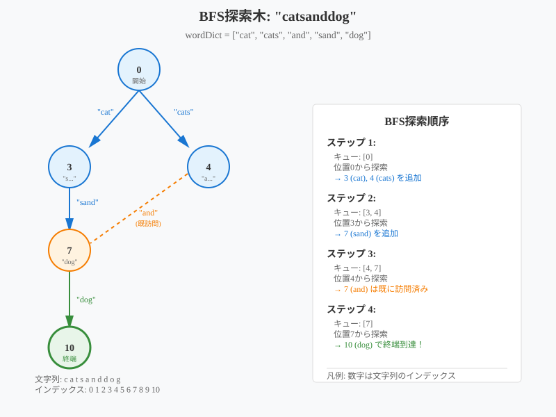
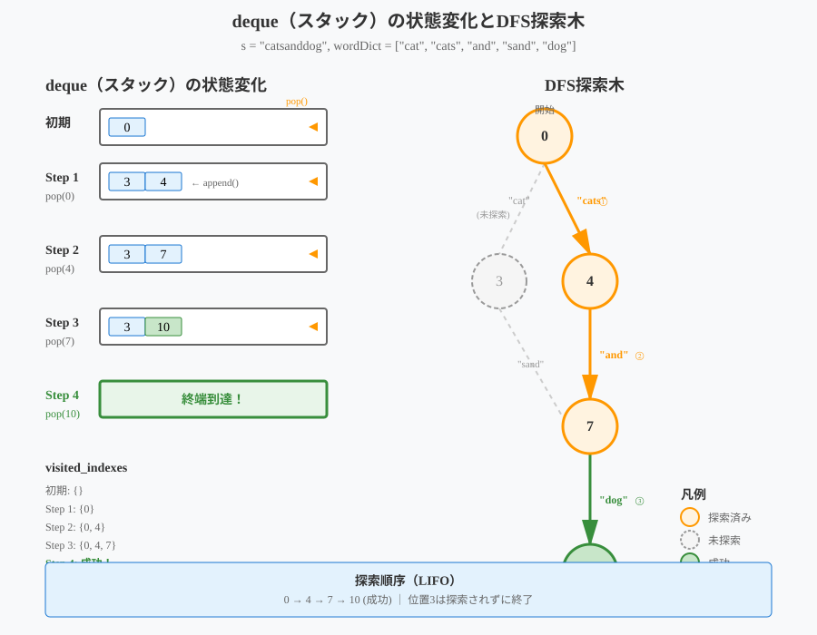

# 139. Word Break
* 問題リンク: https://leetcode.com/problems/word-break/
* 言語: Python3

# Step1
## 解答の方針
* [Longest Substring Without Repeating Characters](https://leetcode.com/problems/longest-substring-without-repeating-characters/)と同様に尺取り法（Sliding Window）っぽい考え方でいけそう？

## テストケースすべて通過しないコード
```python
class Solution:
    def wordBreak(self, s: str, wordDict: List[str]) -> bool:
        start_index = 0
        end_index = 0

        while start_index < len(s):
            for word in wordDict:
                end_index = start_index + len(word)
                if s[start_index:end_index] == word:
                    start_index = end_index
                    break
            if start_index < end_index:
                return False

        return True
```
* いくつかのテストケースは通過するが、`s` = `"cars"` で `wordDict` = `["car","ca","rs"]` の場合、最初の `car` で一致する判定をする（すべての単語を見ない）ので、誤答 `False` を返す。
* なんとなく単語の組み合わせを探索して、一致判定をするのだろうなと思ったが、二重ループになりそうで良い解法を思いつかなかったので、正答を見る

## 正答
```python
class Solution:
    def wordBreak(self, s: str, wordDict: List[str]) -> bool:
        s_size = len(s)
        reachable = [False] * (s_size + 1)
        reachable[0] = True
        word_dict = set(wordDict)

        for start_index in range(s_size + 1):
            for end_index in range(start_index + 1, s_size + 1):
                if reachable[start_index] and s[start_index:end_index] in word_dict:
                    reachable[end_index] = True
        
        return reachable[s_size]
```
* 二重ループでも大した時間はかからない
* 文字列 `s` のそれぞれの位置（インデックス）で「その位置まで分割可能か（ `wordDict` に単語が存在するか）」をbooleanで記録していく（**動的計画法**）
  - 文字列 `s` の最後の位置の記録が `True` なら、分割可能
* 解答時間: 4:22
* 実行時間: 7ms
* 時間計算量: $O(n^3+mk)$
* 空間計算量: $O(n+mk)$

# Step2
## 別解を読む
### 正答を効率化（余分な走査をスキップ）
```python
class Solution:
    def wordBreak(self, s: str, wordDict: List[str]) -> bool:
        s_size = len(s)
        reachable = [False] * (s_size + 1)
        reachable[0] = True
        word_dict = set(wordDict)

        for start_index in range(s_size + 1):
            if not reachable[start_index]:
                continue
            for end_index in range(start_index + 1, s_size + 1):
                if reachable[start_index] and s[start_index:end_index] in word_dict:
                    reachable[end_index] = True
        
        return reachable[s_size]
```
* 実行時間: 3ms

### メモ化再帰を使った解法
```python
class Solution:
    def wordBreak(self, s: str, wordDict: List[str]) -> bool:
        @cache
        def can_break(i):
            if i < 0:
                return True

            for word in wordDict:
                if s[i - len(word) + 1 : i + 1] == word and can_break(i - len(word)):
                    return True

            return False

        return can_break(len(s) - 1)
```
* 動的計画法
* 文字列 `s` の末尾から走査していき、`i < 0`　なら分割可能としている
* `@cache` デコレータ（高階関数）は関数の結果を自動的にキャッシュする（**メモ化**）。
  - 同じ引数の値で関数が呼ばれた時、前回の計算結果を返す
  - cf. https://docs.python.org/ja/3.13/library/functools.html#functools.cache
  - `lru_cache(maxsize=None)` と同じ
    - cf. https://docs.python.org/ja/3.13/library/functools.html#functools.lru_cache
* 短絡評価で副作用のある関数（再帰）があって読みにくい
* `s` のスライスが分かりにくい
* ベースケース `i < 0` が直観的でない
* 実行時間: 7ms
  - 大して変わらなかった

### 幅優先探索を使った解法
```python
class Solution:
    def wordBreak(self, s: str, wordDict: List[str]) -> bool:
        words = set(wordDict)
        index_to_explore = deque([0])
        visited_index = set()

        while index_to_explore:
            start_index = index_to_explore.popleft()
            if start_index == len(s):
                return True
            
            for end_index in range(start_index + 1, len(s) + 1):
                if end_index in visited_index:
                    continue
                if s[start_index:end_index] in words:
                    index_to_explore.append(end_index)
                    visited_index.add(end_index)
        
        return False
```
* 基本的な考え方
  - 文字列のそれぞれの位置（インデックス）をグラフのノードとして考える
  - 位置0（開始位置）から始めて、到達可能な位置を**幅優先探索**（BFS）で探索する
  - 最終位置（文字列の長さ）に到達できれば分割可能
* BFSでは、グラフで同じ階層のノードたちをキュー（待ち行列）に保持する
  - キューはFIFO
  - Pythonでは、コンテナデータ型dequeとして標準モジュールに用意されている
  - スタックとキューを一般化したものらしい
  - cf. https://docs.python.org/ja/3.13/library/collections.html#collections.deque
* `s` = `"catsanddog"`、`wordDict` = `["cat", "cats", "and", "sand", "dog"]` の場合を可視化

  - Claude 4 Opusで作った
* 実行時間: 7ms
  - 大して変わらなかった

### 深さ優先探索を使った方法
```python
class Solution:
    def wordBreak(self, s: str, wordDict: List[str]) -> bool:
        words = set(wordDict)
        index_to_explore = deque([0])
        visited_indexes = set()

        while index_to_explore:
            start_index = index_to_explore.pop()

            if start_index in visited_indexes:
                continue
            
            visited_indexes.add(start_index)
            
            if start_index == len(s):
                return True
            
            for end_index in range(start_index + 1, len(s) + 1):
                if s[start_index:end_index] in words:
                    index_to_explore.append(end_index)
        
        return False
```
* 基本的な考え方
  - 文字列の先頭から開始し、単語を見つけたらその位置の値をスタックに積む
  - バックトラックを使って全ての可能性を試す
* スタックはLIFO
* `s` = `"catsanddog"`、`wordDict` = `["cat", "cats", "and", "sand", "dog"]` の場合を可視化
  - この場合、バックトラックは発生しない
  - 
    - Claude 4 Opusで作った
## 他の方のコードを読む
* https://github.com/Fuminiton/LeetCode/blob/67aee80862c2c27eb26411ae7b05c5f6c9269fba/problem39/memo.md
  - 動的計画法
  - 雑に二重ループだから良くないという感覚だったので、以下のように概算で時間計算量を見積もるのは今後やっていきたいと思った
    - > `O(len(s)^2 * len(wordDict))`となり、大体`300*300*20 ~ 10^6`程度で問題なさそう。
  - 単語の一致の判定に`str.startswith`が使えるのを知った
    - スライスだとshallow copyなので、単に存在確認であればこちらの方が良さそう？
    - cf. https://docs.python.org/ja/3.13/library/stdtypes.html#str.startswith
* https://github.com/fuga-98/arai60/blob/9e0b4995439f57158f4dc9aa4ad6ff7d1bb8d11a/139.%20Word%20Break.md
  - DFSを使った解法
    - dequeの代わりに `list` を使っていて `pop()` を `-1` にしているので少し分かりづらいと思った
  - 「ちぎる」という表現は良いと思った
  - あまりアルゴリズム系のコードを読まないので、問題から「BFSっぽい」とか読み取れる感覚を持てていないなと思った
  - Trie木はオートコンプリートなどで使われるデータ構造との認識（実装大変そう）

## 読みやすく直したコード
BFSを使った方法
```python
class Solution:
    def wordBreak(self, s: str, wordDict: List[str]) -> bool:
        words = set(wordDict)
        index_to_explore = deque([0])
        visited_index = set()

        while index_to_explore:
            start_index = index_to_explore.popleft()
            if start_index == len(s):
                return True
            
            for end_index in range(start_index + 1, len(s) + 1):
                if end_index in visited_index:
                    continue
                if s[start_index:end_index] in words:
                    index_to_explore.append(end_index)
                    visited_index.add(end_index)
        
        return False
```
# Step3
```python
class Solution:
    def wordBreak(self, s: str, wordDict: List[str]) -> bool:
        words = set(wordDict)
        index_to_explore = deque([0])
        visited_index = set()

        while index_to_explore:
            start_index = index_to_explore.popleft()
            if start_index == len(s):
                return True
            
            for end_index in range(start_index + 1, len(s) + 1):
                if end_index in visited_index:
                    continue
                if s[start_index:end_index] in words:
                    index_to_explore.append(end_index)
                    visited_index.add(end_index)
        
        return False
```
* 解答時間
  - 1回目: 4:01
  - 2回目: 3:28
  - 3回目: 3:50
