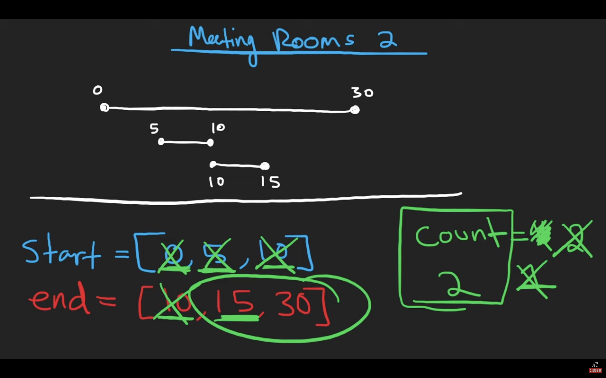

# 253. Meeting Rooms II
- 問題: https://leetcode.com/problems/meeting-rooms-ii
  - NeetCode: https://neetcode.io/problems/meeting-schedule-ii
    - NeetCodeの問題文ではメソッド名とは違い最小の会議**日数**を求めよとなっているが、lintcodeでは最小の会議**室数**を求めよとなっている
- 言語: Python

## Step1
- 252.と同様の考え方で、前の会議終了時刻＞次の会議開始時刻となった場合に会議日数をインクリメントしていく方針とした
- しかし、すべての会議を調べるわけではないので誤って会議日数をカウントしてしまう
- 最大の会議日数＝会議数となるため、すべての会議を調べていき会議時刻が重複しなかったら最大の会議日数からデクリメントする方針とした
- 30分ほど経過していたがテストケースを通過しないため正答を見た

### すべてのテストケースを通過しないコード
```py
"""
Definition of Interval:
class Interval(object):
    def __init__(self, start, end):
        self.start = start
        self.end = end
"""

class Solution:
    def minMeetingRooms(self, intervals: List[Interval]) -> int:
        if len(intervals) <= 1:
            return len(intervals)
        
        sorted_intervals = sorted(intervals, key=lambda x: x.start)
        last_meeting_end = float("inf")
        min_num_days = len(sorted_intervals) - 1
        for i, interval in enumerate(sorted_intervals):
            j = i + 1
            for j in range(len(sorted_intervals) - i):
                if last_meeting_end <= sorted_intervals[j].start:
                    min_num_days -= 1
            last_meeting_end = interval.end
        
        return min_num_days
            
```

### 正答
lintcodeに合わせて、最大会議室数を求めるものとする
- 2つのポインタを使った方法
  - 開始時刻と終了時刻でそれぞれ2つの配列を作る
  - 開始時刻 < 終了時刻の場合：まだどの会議も終わっていない時点で新しい会議が始まるため、追加の会議室が必要
  - 開始時刻 ≥ 終了時刻の場合：少なくとも1つの会議が終了しているので、その会議室を再利用できる
```py
"""
Definition of Interval:
class Interval(object):
    def __init__(self, start, end):
        self.start = start
        self.end = end
"""

class Solution:
    def minMeetingRooms(self, intervals: List[Interval]) -> int:
        starts = sorted(i.start for i in intervals)
        ends = sorted(i.end for i in intervals)

        rooms_count = 0
        max_rooms_count = 0
        s_i = 0
        e_i = 0
        while s_i < len(starts):
            if starts[s_i] < ends[e_i]:
                rooms_count += 1
                max_rooms_count = max(max_rooms_count, rooms_count)
                s_i += 1
            else:
                rooms_count -= 1
                e_i += 1
        
        return max_rooms_count
```
- それぞれの会議の開始時刻と終了時刻を図示すると分かりやすい
  - 
    - 出典: https://youtu.be/FdzJmTCVyJU

## Step2
- 典型コメント集: https://docs.google.com/document/d/11HV35ADPo9QxJOpJQ24FcZvtvioli770WWdZZDaLOfg/edit?tab=t.0#heading=h.c86y3qdg326e
- https://github.com/nittoco/leetcode/pull/45
  - Python
  - 開始時刻と終了時刻をヒープ（優先度付きキュー）で管理
    - すべての会議の開始・終了時刻を時系列（早い順）に並べて、各時点で同時進行している会議数の最大値を求める
    - タプルをキューに入れていく。第1要素は時刻の数値、第2要素はbool値でTrueなら開始時刻、Falseなら終了時刻を表す
    - 開始時刻と終了時刻が同じ場合、第2要素のbool値で比較すると終了時刻が先に来る
    - イベントソーシングの考え方
  - 別解の方法について
    - > これは意味づけの仕方次第じゃないですか。  
        > たとえば、ここの会社では、会議が始まるときに受付に鍵を借りに来て、終わるときに受付の郵便箱に返します。  
        > あなたは受付です。会議が始まるたびに、郵便箱の中の鍵を回収して、手持ちの鍵を渡します。  
        > 会議室の予約の表が与えられるので、最低いくつ鍵が必要か答えてください。
        - cf. https://github.com/nittoco/leetcode/pull/45/files#r1996402752
- https://github.com/Ryotaro25/leetcode_first60/pull/61
  - C++
  - `accumulate()` による関数型っぽい書き方
    - ループでカウンタをインクリメント・デクリメントする方法と同じ
- https://github.com/Yoshiki-Iwasa/Arai60/pull/61
  - Rust
  - 会議をenumで定義して、ドメインオブジェクトとして管理
- https://github.com/olsen-blue/Arai60/pull/57
  - Python
  - あらかじめ取りうる時刻の最大値の配列を作リ、時刻を添字としてその位置に会議数を代入
  - その配列の累積和の瞬間的な最大値を取得する


### 別解
- 最小ヒープ（優先度付きキュー）で終了時刻のみ管理
  - 基本的な考え方
    1. 会議を開始時刻でソート
    2. ヒープで終了時刻を管理（最も早く終わる会議が常にトップ）
    3. 新しい会議を処理する際、最も早く終わる会議と比較
```py
"""
Definition of Interval:
class Interval(object):
    def __init__(self, start, end):
        self.start = start
        self.end = end
"""

class Solution:
    def minMeetingRooms(self, intervals: List[Interval]) -> int:
        sorted_intervals = sorted(intervals, key=lambda x: x.start)
        rooms = []

        for interval in sorted_intervals:
            if rooms and rooms[0] <= interval.start:
                heapq.heappop(rooms)
            heapq.heappush(rooms, interval.end)

        return len(rooms)
```

## Step3
```py
"""
Definition of Interval:
class Interval(object):
    def __init__(self, start, end):
        self.start = start
        self.end = end
"""

class Solution:
    def minMeetingRooms(self, intervals: List[Interval]) -> int:
        intervals.sort(key=lambda x: x.start)
        rooms = []

        for interval in intervals:
            if rooms and rooms[0] <= interval.start:
                heapq.heappop(rooms)
            heapq.heappush(rooms, interval.end)

        return len(rooms)
```
- 解答時間:
  - 1回目: 3:14
  - 2回目: 1:42
  - 3回目: 2:52
