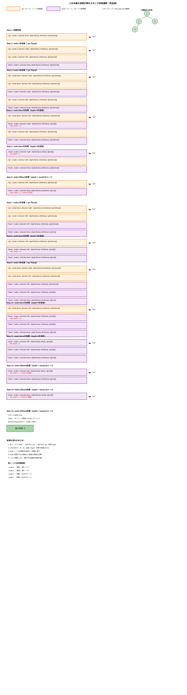

# 104. Maximum Depth of Binary Tree
* 問題: https://leetcode.com/problems/maximum-depth-of-binary-tree/
* 言語: Python

# Step1
* 二分木の最大の深さ（高さ）を求める
* 幅優先探索（BFS）で深さを記録していく

## すべてのテストケースを通過しないコード
```py
class Solution:
    def maxDepth(self, root: Optional[TreeNode]) -> int:
        if root is None:
            return 0
        
        node = root
        visited_nodes = deque([node])
        candidate_tree_depth = []
        tree_depth = 1

        while visited_nodes:
            node = visited_nodes.popleft()
            if node.left:
                visited_nodes.append(node.left)
                tree_depth += 1
            if node.right:
                visited_nodes.append(node.right)
                tree_depth += 1
            if not node.left and not node.right:
                candidate_tree_depth.append(tree_depth)
                tree_depth = 1
        
        return max(candidate_tree_depth)
```
* 完全二分木の場合はうまく動くが、そうでない場合は誤答を返す
* 40分ほど経っていたので正答を見る

## 正答
```py
class Solution:
    def maxDepth(self, root: Optional[TreeNode]) -> int:
        if not root:
            return 0
        
        visited_nodes = deque([root])
        tree_depth = 0

        while visited_nodes:
            tree_depth += 1

            for _ in range(len(visited_nodes)):
                node = visited_nodes.popleft()
                if node.left:
                    visited_nodes.append(node.left)
                if node.right:
                    visited_nodes.append(node.right)
        
        return tree_depth
```
* 同じくBFSを使った方法
* 木のそれぞれの高さ（level）ごとに、その次の同じ高さにあるノードを追加していく

# Step2
## 他人のコードを読む
* 典型コメント: https://docs.google.com/document/d/11HV35ADPo9QxJOpJQ24FcZvtvioli770WWdZZDaLOfg/edit?tab=t.0#heading=h.27jfjzhov3la
* https://github.com/sakupan102/arai60-practice/pull/21
  - Python
  - 深さ優先探索（DFS）を使った方法
    - 再帰によるDFS・下から走査するボトムアップ方式
    ```py
    class Solution:
        def maxDepth(self, root: Optional[TreeNode]) -> int:
            if not root:
                return 0
            right_depth = self.maxDepth(root.right)
            left_depth = self.maxDepth(root.left)
            return max(right_depth, left_depth) + 1
    ```
    - スタックによるDFS・上から配るトップダウン方式
    ```py
    class Solution:
        def maxDepth(self, root: Optional[TreeNode]) -> int:
            if not root:
                return 0
            node_and_depth = [(root, 1)]
            max_depth = 1
            while node_and_depth:
                node, depth = node_and_depth.pop()
                max_depth = max(max_depth, depth)
                if node.right:
                    node_and_depth.append((node.right, depth + 1))
                if node.left:
                    node_and_depth.append((node.left, depth + 1))
            return max_depth
    ```
    - 再帰によるDFS・上から配るトップダウン方式
    ```py
    class Solution:
        def maxDepth(self, root: Optional[TreeNode]) -> int:
            max_depth = 0
            def dive_into_leaf(node, depth):
                nonlocal max_depth
                if not node:
                    return
                max_depth = max(max_depth, depth)
                dive_into_leaf(node.left, depth + 1)
                dive_into_leaf(node.right, depth + 1)
            dive_into_leaf(root, 1)
            return max_depth
    ```
    - スタックによるDFS・下から走査するボトムアップ方式
    ```py
    class Solution:
        def maxDepth(self, root: Optional[TreeNode]) -> int:
            if not root: 
                return 0
            node_info = [("go", (root, None, [None], [None], [None]))] # (node, direction, depth, left_depth, right_depth)
            while node_info:
                go_back_flag, args = node_info.pop()
                if go_back_flag == "go":
                    node, direction, depth_ref, left_depth_ref, right_depth_ref = args
                    if not node:
                        depth_ref[0] = 0
                        continue
                    node_info.append(("back", args))
                    node_info.append(("go", (node.left, "left", left_depth_ref,[None], [None])))
                    node_info.append(("go", (node.right, "right", right_depth_ref, [None], [None])))
                if go_back_flag == "back":
                    node, direction, depth_ref, left_depth_ref, right_depth_ref = args
                    depth_ref[0] = max(left_depth_ref[0], right_depth_ref[0]) + 1
                    if not direction:
                        return depth_ref[0]
    ```
    
      - Claude 4 Opusで作成

# Step3
* スタックによるDFS・上から配るトップダウン方式
```py
class Solution:
    def maxDepth(self, root: Optional[TreeNode]) -> int:
        if not root:
            return 0
        
        node_and_depth = [(root, 1)]
        max_depth = 0

        while node_and_depth:
            node, depth = node_and_depth.pop()
            max_depth = max(max_depth, depth)
            if node.right:
                node_and_depth.append((node.right, depth + 1))
            if node.left:
                node_and_depth.append((node.left, depth + 1))
        
        return max_depth
```
* 解答時間
  - 1回目: 1:45
  - 2回目: 2:08
  - 3回目: 2:17
