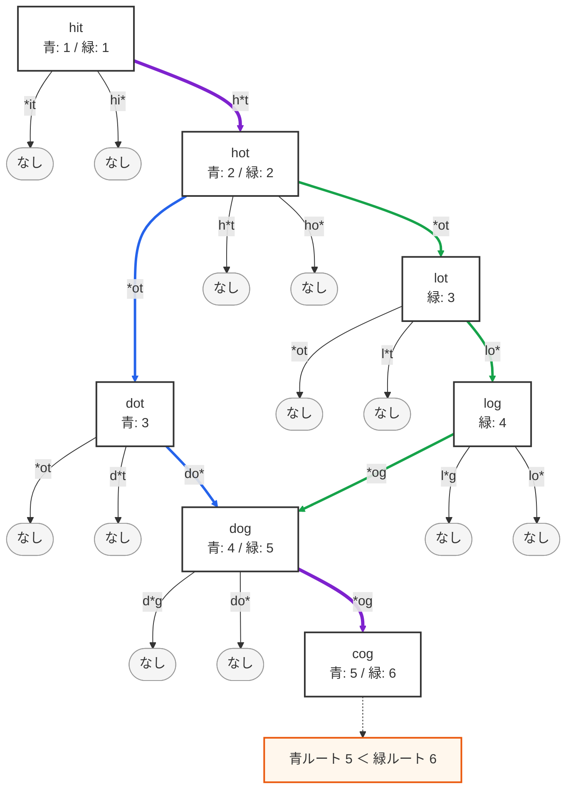

# 127. Word Ladder
- 問題: https://leetcode.com/problems/word-ladder/
- 言語: Python

## Step1
### 方針
- 紙に後述の探索グラフを書いて、以下の処理を考えた。
1. `beginWord` を初期文字列とし、文字列の左側から1文字ずつ「任意の1文字」にマッチする word を `wordList` から正規表現で探す
2. ヒットしたら、そのヒットした word で 1. を処理。この時、すでに探索した word は対象外とする。探索経路の長さを +1 する。
3. `endWord` がヒットしたら探索を止める。今回の探索経路の長さを、前回（初回は inf）の探索経路の長さの最小値を取る。
### 探索グラフ

- 30分経過したため正答をみる

### WA
```py
class Solution:
    def ladderLength(self, beginWord: str, endWord: str, wordList: List[str]) -> int:
        if endWord not in wordList:
            return 0

        visited_words = []
        candidate_words = [beginWord]
        min_path_len = float("inf")
        path_len = 1
        while candidate_words:
            word = candidate_words.pop()
            visited_words.append(word)
            for j in range(len(beginWord)):
                pattern = re.compile(f"{word[:j]}.{word[j + 1 :]}")
                matched_words = list(filter(pattern.match, wordList))
                matched_words = [w for w in matched_words if w not in visited_words]
                if matched_words is not None:
                    path_len += 1
                    for candidate_word in matched_words:
                        if candidate_word == endWord:
                            min_path_len = min(min_path_len, path_len)
                            continue
                        if candidate_word not in visited_words:
                            candidate_words.append(candidate_word)

        return min_path_len
```
- BFSではなくDFSになっている
  - 最小値を取るとかいう方法ではなく、素朴にBFSで最短経路探索をすれば良い
- `path_len` が「探索の深さ（レベル）」ではなく、単語1文字ごとのループを回すたびに無条件でインクリメントされる
- `if matched_words is not None:` が常にTrue
- 正規表現がプレフィックスマッチしかしていない
  - `re.match` は文字列の先頭からマッチするか調べるだけ
  - `hit` から作ったパターンが `hits` のような長い単語にもマッチする可能性がある
    - cf. https://docs.python.org/ja/3/library/re.html#re.match
  - 今回は `re.fullmatch` か、`$` で終端を固定する
- `visited_words` がリストで in が $O(n)$
  - Set を使うべき
- 訪問済み判定のタイミングがズレている
- 早期終了できない

### 正答
#### 方針
- 探索グラフの考え方はOK
- BFSを使う
  - キューには `(単語, その単語までの距離)` を持たせ、pop時にそのまま返せば最短性が保証される
- 26文字総当たりで変化候補を作る方式にすると、正規表現より高速かつ上記の完全一致問題も自然に回避できる

```py
class Solution:
    def ladderLength(self, beginWord: str, endWord: str, wordList: List[str]) -> int:
        word_set = set(wordList)
        if endWord not in word_set:
            return 0

        candidate_words = deque([(beginWord, 1)])
        visited = {beginWord}

        while candidate_words:
            word, distance = candidate_words.popleft()
            if word == endWord:
                return distance

            for i in range(len(word)):
                for c in "abcdefghijklmnopqrstuvwxyz":
                    if c == word[i]:
                        continue
                    next_word = word[:i] + c + word[i + 1 :]
                    if next_word in word_set and next_word not in visited:
                        visited.add(next_word)
                        candidate_words.append((next_word, distance + 1))

        return 0
```
- 時間計算量: $O(N⋅26⋅L^2)$
  - `N = len(wordList), L = len(beginWord)`、 アルファベット数: `Σ = 26`
  - 見積: $N = 5000, L = 10$ 、 Python: $10^7$ ステップ/秒 としたとき、
    - $26 × 5000 × 10^2 = 13,000,000 ≈ 1.3 × 10^7 ステップ$
    - $1.3 × 10^7 / 10^7 ​ ≈ 1.3 秒$
- 空間計算量: $O(N·L)$

## Step2
- 典型コメント集: https://docs.google.com/document/d/11HV35ADPo9QxJOpJQ24FcZvtvioli770WWdZZDaLOfg/edit?tab=t.0#heading=h.s53ke8m2udzm

- https://github.com/hayashi-ay/leetcode/pull/42
  - Python
  - 隣接リストでグラフを作成してからBFSで探索する方法
    - 先にグラフをすべて作成する発想はなかった
    - 正規表現で `re.match` を使っているが、今回の問題は3文字で固定なので結果には影響しなさそう
  - 両側から探索する方法
  - 関連する概念: 編集距離（edit distance）、ハミング距離（Hamming distance）、レーヴェンシュタイン距離（Levenshtein distance）
    - cf. https://en.wikipedia.org/wiki/Hamming_distance , https://en.wikipedia.org/wiki/Levenshtein_distance
  - バケットを作ってバケット内でのみ比較すればいいというやりかた: https://discord.com/channels/1084280443945353267/1200089668901937312/1216123084889788486
    - cf. https://cs.stackexchange.com/questions/93467/data-structure-or-algorithm-for-quickly-finding-differences-between-strings
    - 鳩の巣原理（pigeonhole principle）のこと？

- https://github.com/goto-untrapped/Arai60/pull/57
  - Java
  - 全辺の重みが1の無向・非重み付きグラフとみなして、最短経路問題としてダイクストラ法が使える
  - 気を抜くとすぐTLEするからHard？

- https://github.com/shining-ai/leetcode/pull/20
  - Python
  - 正規表現を使う場合 pattern : word のハッシュマップでキャッシュしないとTLEになるっぽい
    - 同じパターンを何度も生成するから

## Step3
```py
class Solution:
    def ladderLength(self, beginWord: str, endWord: str, wordList: List[str]) -> int:
        word_set = set(wordList)
        if endWord not in word_set:
            return 0

        candidate_words = deque([(beginWord, 1)])
        visited = {beginWord}

        while candidate_words:
            word, distance = candidate_words.popleft()
            if word == endWord:
                return distance

            for i in range(len(word)):
                for c in "abcdefghijklmnopqrstuvwxyz":
                    if c == word[i]:
                        continue
                    next_word = word[:i] + c + word[i + 1 :]
                    if next_word in word_set and next_word not in visited:
                        visited.add(next_word)
                        candidate_words.append((next_word, distance + 1))

        return 0
```
- 所要時間:
  - 1回目: 5:33
  - 2回目: 4:37
  - 3回目: 4:57
