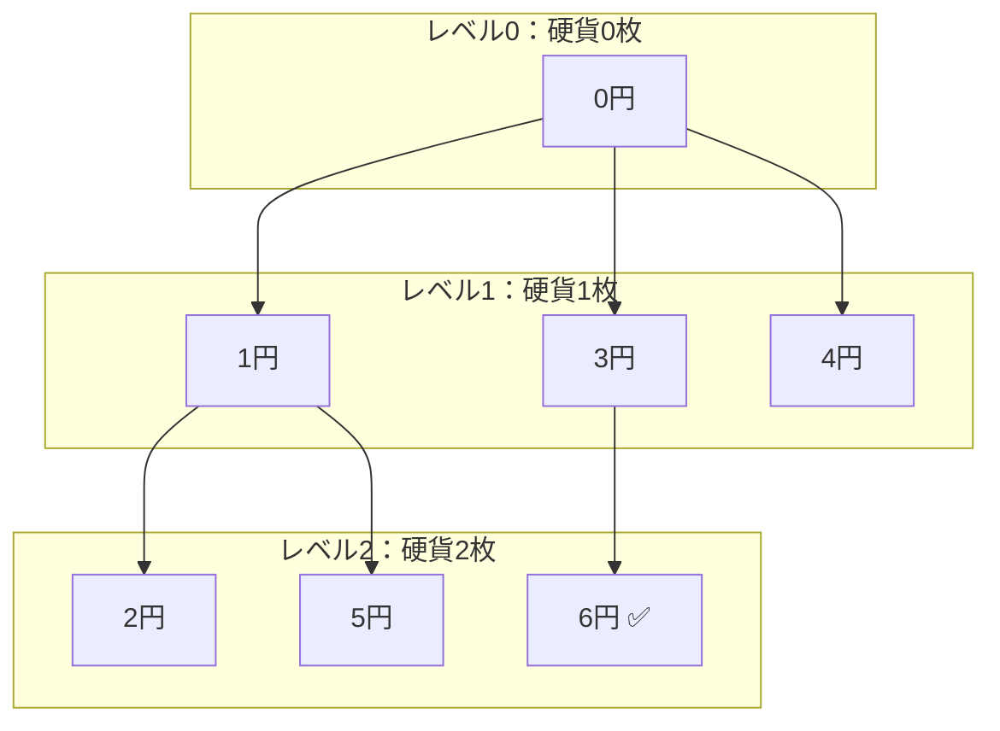

# 322. Coin Change
- 問題: https://leetcode.com/problems/coin-change/
- 言語: Python

## Step1
### 方針
- まずは貪欲（greedy）に、大きい額面の硬貨から順に amount の金額を作れないか試す
  - 11 - 5 - 5 = 1, 1 - 1 = 0
- いくつかのテストケースではうまくいくが、やはりDPでないとダメそう？
- 15分経過したため正答を見る

#### WA(Greedyな方法)
```py
class Solution:
    def coinChange(self, coins: List[int], amount: int) -> int:
        if amount == 0:
            return 0
        
        sorted_coins = sorted(coins, reverse=True)
        current_index = 0
        current_value = amount
        candidate_num_coins = 0

        while current_index < len(sorted_coins):
            current_value -= sorted_coins[current_index]

            if current_value == 0:
                candidate_num_coins += 1
                return candidate_num_coins
            
            if current_value > 0:
                candidate_num_coins += 1
                continue            
            
            current_value += sorted_coins[current_index] # 引きすぎた分を元に戻す
            current_index += 1
        
        return -1
```
- 一度ある硬貨を使うと決めたらバックトラックしないため、「大きい硬貨を使いすぎたせいで、後の組み合わせが悪くなる」ケースを検出できない

#### 正答
### 直観
ある金額に対して、まず1種類の硬貨（例えば1円硬貨）を使ってみて、「残りの金額 - 1を作るのに必要な最小の硬貨枚数」を考える。これをすべての硬貨について試し、最も良い結果を選ぶ。

### 方針1: DP
- ボトムアップ的に答えを考える
- `min_num_coins[current_amount]` = 金額 `current_amount` をちょうど作るために必要な硬貨の最小枚数
- 全ての硬貨を試して、その中で最小になるものを採用
- `min_num_coins[0] = 0`（何も硬貨を使わずに金額0を作れる）を土台にして、$i = 1, 2, ..., amount$ の順に小さい金額から順番に埋めていく

```py
class Solution:
    def coinChange(self, coins: List[int], amount: int) -> int:
        min_num_coins = [float("inf")] * (amount + 1)
        min_num_coins[0] = 0

        for current_amount in range(1, amount + 1):
            for coin in coins:
                if current_amount >= coin:
                    min_num_coins[current_amount] = min(min_num_coins[current_amount], min_num_coins[current_amount - coin] + 1,)
        
        if min_num_coins[amount] != float("inf"):
            return min_num_coins[amount]
        else:
            return -1
```
- `min_num_coins[current_amount]`：すでに見つかっている、金額 `current_amount` を作る最小枚数
- `min_num_coins[current_amount - coin] + 1`：金額 `current_amount - coin` を最小枚数で作り、最後に `coin` を1枚足した場合
- 時間計算量: $O(n^{2})$
  - $O(amount × len(coins))$
  - n = 12 の場合、 $(10^{4} × 12) / 10^{7} = 1.2 × 10^{−2} = 12$ ms
- 空間計算量: $O(n)$

### 方針2: Top-down（メモ化再帰DFS）
- 金額 `amount` から順番に試していくTop-downなアプローチ

```py
class Solution:
    def coinChange(self, coins: List[int], amount: int) -> int:
        @cache
        def search_candidate(remain: int) -> int:
            # 金額をちょうど作れた
            if remain == 0:
                return 0

            # 金額を超えて硬貨を使ってしまった
            if remain < 0:
                return float("inf")

            min_coins = float("inf")

            # 最後に使う硬貨をすべて試す
            for coin in coins:
                candidate = search_candidate(remain - coin) + 1
                min_coins = min(min_coins, candidate)

            return min_coins

        min_num_coins = search_candidate(amount)

        if min_num_coins != float("inf"):
            return min_num_coins
        else:
            return -1
```
- 時間計算量: $O(n^{2})$
  - $O(amount × len(coins))$
- 空間計算量: $O(n)$

## Step2
- 典型コメント集: https://docs.google.com/document/d/11HV35ADPo9QxJOpJQ24FcZvtvioli770WWdZZDaLOfg/edit?tab=t.0#heading=h.ic8466had15a

- https://github.com/nittoco/leetcode/pull/38
  - Python
  - DPはDPでも2次元DPの方法、コードが長くなりがち？
  - `amount` を硬貨で表現できない場合をinfではなくNoneで配列を初期化している
    - Noneだと `None + 1` や `min(None, 3)` ができないのでちょっと面倒

- https://github.com/Ryotaro25/leetcode_first60/pull/44
  - C++
  - 到達不能のときの `-1` はマジックナンバーなので、定数化したほうがわかりやすい

- https://github.com/seal-azarashi/leetcode/pull/37
  - Java
  - 重み1の最短経路問題として解く（BFS）
    - 頂点：現在の合計金額
    - 辺：硬貨を1枚追加する操作
    - 辺のコスト：硬貨1枚なので常に1
    - 開始地点：金額 `0`
    - 目的地点：金額 `amount`
      - `new CoinState(3, 11)` なら「硬貨を3枚使って、現在11円になっている」状態
  - iterative DFSの方法

- https://github.com/Yoshiki-Iwasa/Arai60/pull/54
  - Rust
  - 変数に複数の意味を持たせるか？

- https://github.com/TORUS0818/leetcode/pull/42
  - Python
  - 答えの変数を -1 で初期化しているけど、inf で初期化の方が直観的かな
  - 候補の生成にジェネレーターを使う方法
    - 以下のようにも書けるらしい（ジェネレーター式）
        ```py
        class Solution:
            def coinChange(self, coins: List[int], amount: int) -> int:
                @cache
                def coin_change_helper(remain: int) -> float:
                    if remain == 0:
                        return 0
        
                    if remain < 0:
                        return inf
        
                    return min(coin_change_helper(remain - coin) + 1 for coin in coins)
        
                num_coins = coin_change_helper(amount)
                return -1 if num_coins == inf else int(num_coins)
        ```
  - BFSで状態に硬貨の枚数ではなく、階層を表すリストを2つ用意する
    - 硬貨が1枚増えるたびに作った「次の階層のリスト」を、次のループでは「現在の階層」として扱う
    - 
      ```py
      class Solution:
          def coinChange(self, coins: List[int], amount: int) -> int:
              if amount == 0:
                  return 0
              current_amounts = [0]
              found = set()
              num_coins = 1
              while current_amounts:
                  next_amounts = []
                  for current_amount in current_amounts:
                      for coin in coins:
                          next_amount = current_amount + coin
                          if amount == next_amount:
                              return num_coins
                          if amount < next_amount:
                              continue
                          if next_amount in found:
                              continue
                          found.add(next_amount)
                          next_amounts.append(next_amount)
                  current_amounts = next_amounts
                  num_coins += 1
              return -1
      ```
      - cf. https://github.com/TORUS0818/leetcode/pull/42#discussion_r1904160562
    - 図解


## Step3
### DP
```py
class Solution:
    def coinChange(self, coins: List[int], amount: int) -> int:
        UNREACHABLE = -1
        min_num_coins = [float("inf")] * (amount + 1)
        min_num_coins[0] = 0

        for current_amount in range(1, amount + 1):
            for coin in coins:
                if current_amount >= coin:
                    min_num_coins[current_amount] = min(min_num_coins[current_amount], min_num_coins[current_amount - coin] + 1,)
        
        if min_num_coins[amount] != float("inf"):
            return min_num_coins[amount]
        else:
            return UNREACHABLE
```
- 所要時間:
  - 1回目: 3:22
  - 2回目: 2:36
  - 3回目: 3:02
